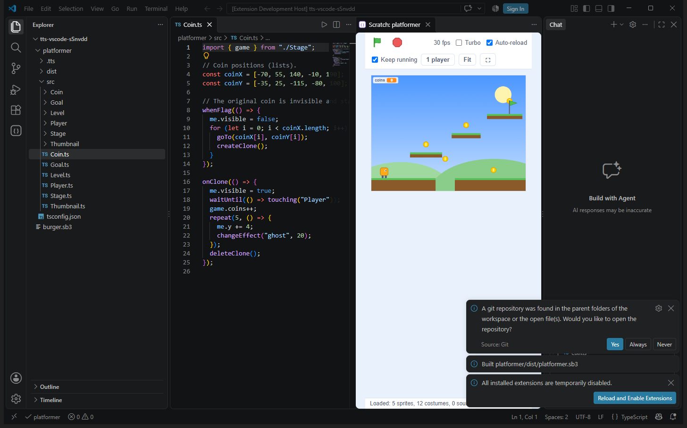
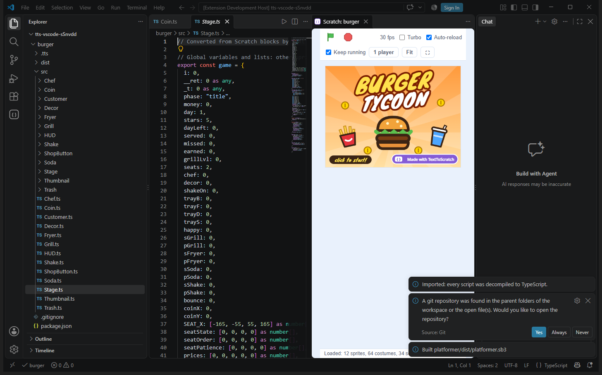

# TextToScratch for VS Code

Build Scratch games in typed TypeScript without leaving VS Code. Every function compiles to a real Scratch block, and the result is a normal `.sb3` you can open in Scratch or TurboWarp.



## Features

- **IntelliSense out of the box.** Opening a project writes `tsconfig.json` and the `.tts/` typings, so you get completion, type errors and hover docs for every Scratch block. Sprite, costume and sound names are type-checked unions that update as soon as you add a file to an asset folder.
- **TextToScratch errors in the Problems panel.** Each save runs the real compiler and reports what TypeScript can't catch, such as constructs Scratch can't express.
- **Game viewer.** Runs your game with the real `scratch-vm` and `scratch-render`, with the green flag, stop, turbo mode, an FPS readout, stage sizes and full screen. Variable and list monitors, keyboard and mouse, `ask and wait`, sounds, and bitmap and SVG costumes all work. It rebuilds and reloads on save, and presses the green flag again if the game was running. **2 players** mode runs two copies side by side, each in its own frame, sharing simulated cloud variables, so you can test `tts/net` multiplayer games locally.
- **Projects.** The *New Project* command creates an empty project or starts from one of the example games. *Import Scratch Project* accepts a `.sb3` file or a scratch.mit.edu link. It decompiles every sprite to TypeScript, puts each costume and sound in its sprite's folder, keeps the original as `project.sb3` so nothing is lost, and lists decompiler warnings in Problems.
- **Build, Export .sb3, Open in Scratch / TurboWarp.**
- **Sprites view** in the activity bar. It lists each sprite with its costumes and sounds, and you can click any of them to open the file.
- **Snippets** for `whenFlag`, `whenKey`, `onMessage`, `onClone`, `forever`, `repeat`, arrow-key movement and clone spawners.



## Project layout

```
my-game/
  src/
    Stage.ts       the stage (exported objects are global variables)
    Player.ts      one file per sprite
    Player/        images become costumes, wav/mp3 files become sounds
  project.sb3      optional: art and sounds from a project saved in Scratch
  dist/my-game.sb3 build output
```

## Settings

| Setting | Default | |
|---|---|---|
| `texttoscratch.buildOnSave` | `true` | Compile on every save |
| `texttoscratch.autoReload` | `true` | Reload the viewer after each successful build |
| `texttoscratch.keepRunning` | `true` | Press the green flag again after a reload if the game was running |

The compiler is bundled, so you don't need `npm install`. Docs: https://github.com/KashTheKing/TextToScratch
